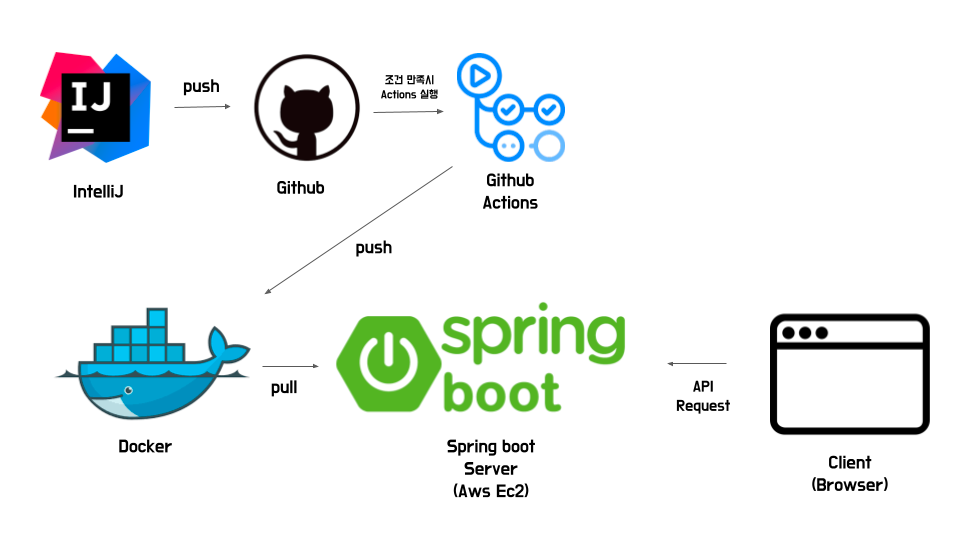

# Intro
매번 새로운 커밋이 발생할 때마다 서버에 새로운 버전으로 업로드하고, 기존에 실행 중이던 프로세스를 종료한 후, 새로 업로드한 프로젝트를 실행하는 일련의 과정은 상당히 번거로웠다.

그래서 Github Action을 활용한 SpringBoot 프로젝트의 CI/CD 파이프라인 구축 방법에 대해 알아볼것.

이번 글의 목표는 main 브랜치에 push가 발생하는 경우 자동으로 서버에 배포되도록 하는 파이프라인을 구축하는 것.

# 프로젝트 생성

## 실행 테스트

### 명령어
git remote add origin git@github.com:ShanePark/ci-cd-example.git
git branch -M main
git push -u origin main

# 도커 허브

# 실행

